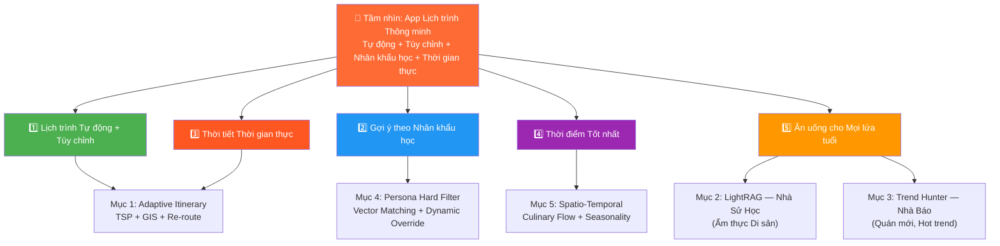
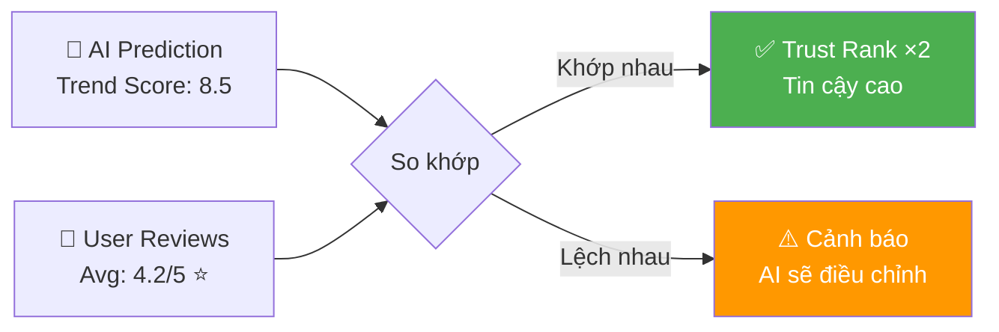
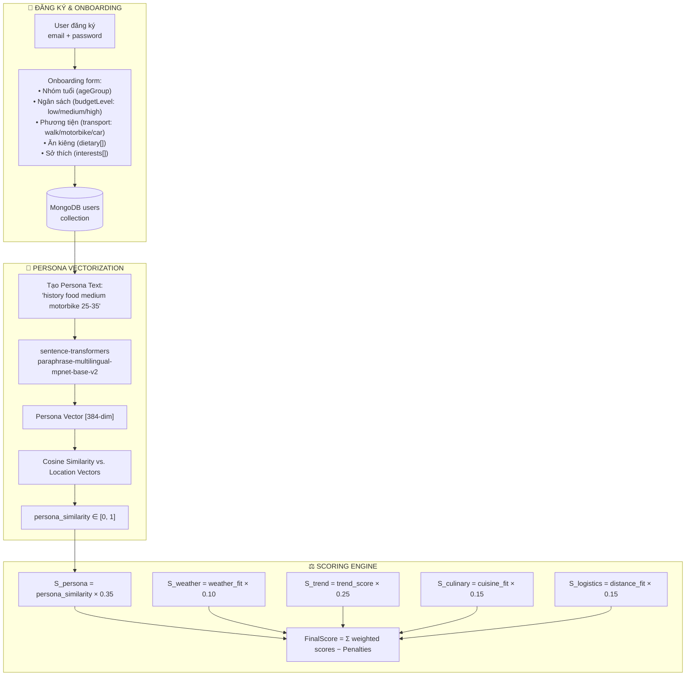
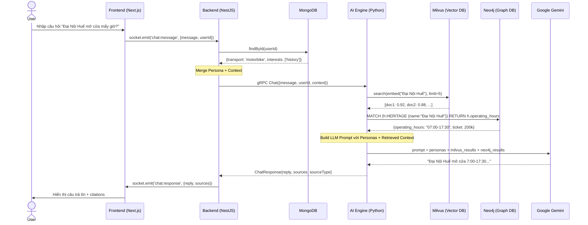
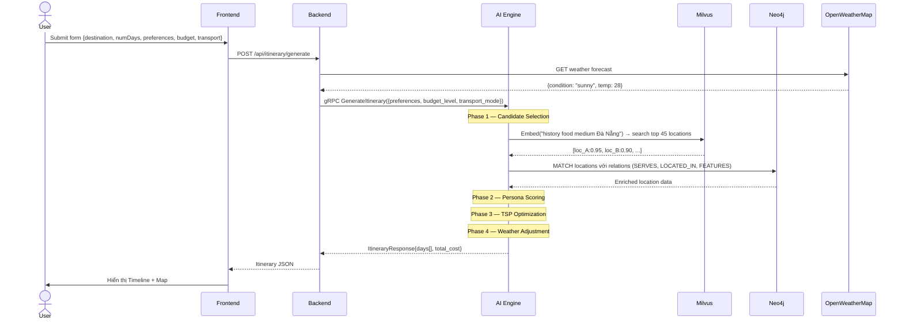
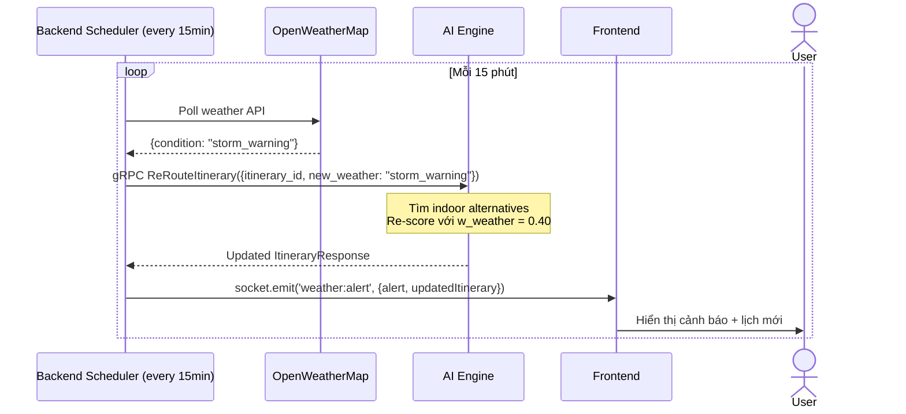
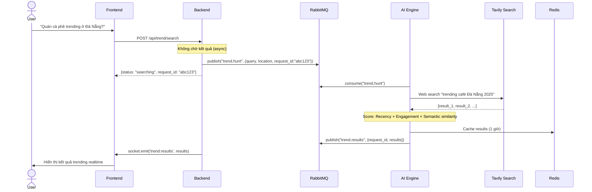
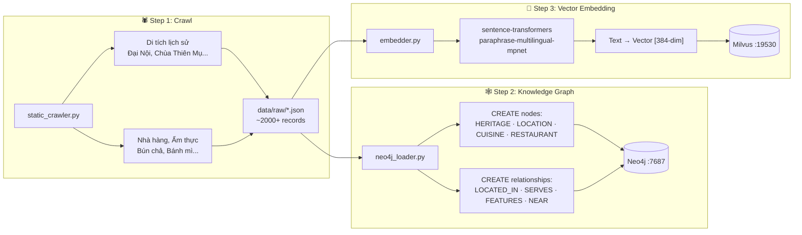

# 🌙 LUNA TravelTech — AI-Powered Smart Travel Planner

> **Hệ thống lập lịch trình du lịch thông minh** cho khu vực miền Trung Việt Nam (Huế – Đà Nẵng – Hội An), ứng dụng AI đa tầng: Personalization, LightRAG Knowledge Graph, Real-time Trend Hunting và Spatio-Temporal Awareness.

---

### Bản đồ Tính năng → Mục tiêu



---

## 📁 Cấu trúc Thư mục (AI Engine)

```
ai-engine/
├── .env                  # (Bảo mật) Chứa toàn bộ cấu hình Port, API Keys, DB URI, RabbitMQ Host
├── .env.example          # Template danh sách các biến cần thiết
├── requirements.txt      # Khai báo thư viện (hoặc Pipfile / pyproject.toml)
├── protos/               # Nơi chứa các hợp đồng giao tiếp .proto
├── src/
│   ├── config/           # Loader và Validator cho các biến từ file .env
│   ├── grpc_server/      # Code khởi chạy gRPC thuần (Thin layer, setup Ports, Workers)
│   ├── message_queue/    # Consumers / Producers kết nối RabbitMQ (Lắng nghe sự kiện)
│   ├── services/         # Fat layer - Chứa lõi Logic, thuật toán tính điểm, LightRAG
│   ├── clients/          # Các class chuyên đi gọi hệ thống khác (Tavily HTTP Client, Neo4j Driver)
│   └── utils/            # Helper functions, formatters (JSON parsing)
└── main.py               # Entry point duy nhất (Root). Chỉ chứa vài dòng code để assemble và run gRPC & MQ listeners
```

> **Nguyên tắc thiết kế:** `grpc_server/` và `message_queue/` là **Thin Layer** (chỉ setup). Toàn bộ business logic tập trung tại `services/`. `main.py` chỉ assemble và khởi động — không chứa logic.

---

## 🌟 Tính năng Cốt lõi

### 1. Cơ chế Tạo & Điều phối Lịch trình Tự động (Adaptive Itinerary Generator)

Khác với các list gợi ý địa điểm rời rạc, hệ thống tự động sinh ra một **lịch trình hoàn chỉnh** (VD: Chuyến đi 3 ngày 2 đêm tại Đà Nẵng). LUNA áp dụng mô hình **Cá nhân hóa Sâu (Deep Personalization)** tương tự Netflix / Spotify / YouTube — không có hai người dùng nào nhận được lịch trình hoàn toàn giống nhau.

#### 🌐 Tính mở rộng (Scalability)

- **Plug-and-Play Data:** Thiết kế dạng Module rời. Mở rộng từ miền Trung sang toàn quốc chỉ cần nạp thêm dữ liệu vào Milvus/Neo4j, không sửa logic code.
- **Feedback Loop:** Mỗi lần user bấm "Thay đổi địa điểm" (Swap), hệ thống ghi nhận và tinh chỉnh trọng số (Weights) trong tương lai — LUNA ngày càng hiểu bạn hơn.

#### ⚡ Tùy chỉnh Linh hoạt

| Hành động | Cách hoạt động |
|-----------|---------------|
| **Thêm địa điểm** | User tìm/chọn từ bản đồ → Hệ thống tự xếp vào TimeSlot phù hợp nhất (giờ mở cửa, khoảng cách) |
| **Xóa địa điểm** | Bỏ 1 điểm → Hệ thống tự tối ưu lại tuyến đường cho các điểm còn lại |
| **Khóa địa điểm** 📌 | Đánh dấu "nhất định phải đi" → Thuật toán xếp các điểm khác xung quanh điểm bị khóa |
| **Đổi thứ tự** | Kéo-thả (drag-drop) TimeSlot → Hệ thống tự kiểm tra xung đột (giờ mở cửa, thời tiết) |
| **Thay đổi ngày** | Kéo dài / rút ngắn chuyến đi → Re-generate lịch trình với constraint mới |
| **Thay phương tiện** | Đổi từ Ô tô → Xe máy → Mở khóa quán trong hẻm nhỏ, loại bỏ ràng buộc bãi xe |

#### 💰 Kiểm soát Ngân sách (Budget Tracking)

Hệ thống theo dõi chi phí **theo thời gian thực**:

| Loại chi phí | Nguồn dữ liệu | Ví dụ |
|-------------|---------------|-------|
| Vé tham quan | Crawl từ web chính thức | Đại Nội: 200K/người |
| Ăn uống | `price_range` trong metadata | Bún Bò Huế: 35–50K/tô |
| Di chuyển | Mapbox Directions API (khoảng cách × giá/km) | Grab: ~15K/km |
| Lưu trú | Crawl Booking/Agoda | Homestay: 300–500K/đêm |

**Ngưỡng cảnh báo:**

| Mức | Hành động |
|:---:|----------|
| **70%** | Hiển thị nhẹ: "Bạn đã dùng 70% ngân sách" |
| **90%** | Cảnh báo vàng: Tự động chuyển gợi ý sang `target_budget = low` |
| **100%** | Cảnh báo đỏ: "Vượt ngân sách! Gợi ý điểm đến miễn phí" + chặn gợi ý `high` |

**Ví dụ cảnh báo thực tế:**

```
📊 Ngân sách: 2.000.000đ cho 3 ngày

Ngày 1: Đại Nội (200K) + Bún Bò (50K) + Grab (30K) + Café (45K) = 325K
Ngày 2: Bà Nà Hills (900K) + Lunch (150K) + Grab (60K) = 1.110K
         ⚠️ CẢNH BÁO: Đã dùng 72% ngân sách! Còn 565K cho Ngày 3.

→ Hệ thống tự động:
  1. Ưu tiên gợi ý địa điểm FREE (Bãi biển Mỹ Khê, Cầu Rồng, Chợ Hàn)
  2. Gợi ý đồ ăn budget thấp (Mì Quảng 30K, Bánh Tráng Cuốn 25K)
  3. Gợi ý đi bộ/xe máy thay vì Grab
```

#### 🗺️ Bản đồ & Điều hướng (Map Navigation)

| Tính năng | Công nghệ | Trạng thái |
|----------|----------|:----------:|
| Hiển thị tuyến đường đa điểm (A → B → C → D) | Mapbox Directions API | ✅ MVP |
| Ước tính thời gian di chuyển giữa các điểm | Mapbox Directions API (`duration`) | ✅ MVP |
| Phân biệt đường xe máy vs ô tô | Tham số `profile`: `driving` / `cycling` | ✅ MVP |
| Hiển thị real-time traffic (kẹt xe) | Mapbox Traffic Layer | ✅ MVP |
| Chỉ đường turn-by-turn | Mapbox Navigation SDK | 📋 Phase 2 |

```javascript
// Lấy tuyến đường tối ưu giữa các điểm trong lịch trình
const waypoints = itinerary.slots
  .map(slot => `${slot.lng},${slot.lat}`)
  .join(';');

const profile = user.transport === 'car' ? 'driving' : 'cycling';

const response = await fetch(
  `https://api.mapbox.com/directions/v5/mapbox/${profile}/${waypoints}` +
  `?geometries=geojson&overview=full&steps=true&access_token=${MAPBOX_TOKEN}`
);

const data = await response.json();
// data.routes[0].duration  → Tổng thời gian (giây)
// data.routes[0].distance  → Tổng khoảng cách (mét)
// data.routes[0].geometry  → GeoJSON để vẽ tuyến đường trên bản đồ
// data.routes[0].legs[]    → Chi tiết từng chặng (A→B, B→C, ...)
```

> **Phase 2:** Turn-by-turn chi tiết sẽ phát triển ở giai đoạn sau. Ở MVP, user bấm **"Mở Google Maps"** để dẫn đường tới điểm tiếp theo.

#### Các cơ chế bổ trợ

- **Anti-Loop (Chống vòng lặp):** Áp dụng *Penalty* để tránh lặp lại trải nghiệm. VD: Nếu sáng đã uống Cafe, hệ thống giảm 50% trọng số mọi quán Cafe vào buổi trưa.
- **Crowd Control Vector:** Khi địa điểm quá tải, thuật toán tự Re-route sang tọa độ tương tự nhưng vắng vẻ hơn.
- **Real-time Weather Re-routing:** Liên tục check API thời tiết. Khi có mưa dông, gửi Push Notification và ưu tiên địa điểm `[Indoor]`, `[Sheltered]`.

---

### 2. LightRAG — Nhà Sử Học (Knowledge Graph)

Mục tiêu quan trọng nhất khi áp dụng AI vào Du lịch Di sản là **Sự chính xác tuyệt đối**.

- **Vấn đề RAG cũ:** AI có xu hướng tổng hợp từ nguồn rác hoặc "tự bịa" (Hallucination) các đời Vua, sự kiện lịch sử.
- **Sức mạnh LightRAG:** Dữ liệu cốt lõi (sự kiện lịch sử, năm xây dựng, di sản văn hóa) được nhúng sâu vào cấu trúc Đồ thị (Neo4j). Khi có câu hỏi lịch sử, AI bắt buộc đi theo các "Cạnh" (Edges) đã được kiểm duyệt.
- **Kết quả:** Câu trả lời như một "Nhà sử học" bản địa, tuyệt đối trung thành với Ground Truth và từ chối thông tin bịa đặt.

---

### 3. Real-time Trend Hunter — Nhà Báo

Thay vì nạp toàn bộ dữ liệu Trending vào Graph (gây rác vì Trend tuổi thọ ngắn), hệ thống dùng một Agent độc lập hoạt động như "Nhà báo".

- **Prompt Engineering nâng cao:** Khi hỏi "Tối nay Đà Nẵng có gì hot?", AI kích hoạt Search Agent bắn Prompt trực tiếp ra công cụ tìm kiếm:

```
site:tiktok.com "Đà Nẵng" "review" "hot trend" "mới mở" t11/2023
site:facebook.com "sự kiện" "tối nay" "Huế"
```

- **Structured JSON Output:** Dữ liệu cào về bắt buộc được "nhả" ra dạng JSON tinh gọn (Pydantic validation), đóng gói **Protobuf** và truyền qua **gRPC** thẳng về NestJS:

```json
{
  "place_name": "Quán Tạm",
  "trend_score": 9.2,
  "category": "Acoustic Bar",
  "price_tag": "$$",
  "matched_source": "tiktok.com/..."
}
```

- **Lợi ích:** Hệ thống luôn cập nhật quán mới mở tuần trước, sự kiện âm nhạc Pop-up tối nay mà không cần chạy lại toàn bộ Data Pipeline.

---

### 4. Bộ lọc Cá nhân hóa Đa tầng (Demographics & Persona Hard Filter)

Dù ở chế độ Suggestion hay Auto-Itinerary, mọi kết quả đều đi qua **"Màng lọc cứng" (Hard Filter)**.

- **Persona Vector Matching:** Số hóa độ tuổi, ngân sách, sở thích thành Vector 384-dim.

  > **VD:** Người dùng *[Tuổi Trung niên, Yêu Lịch sử, Cafe tĩnh lặng, Ngân sách Tầm trung]* → Vector tương ứng.

- **Conflict Resolution:** Dù Search Agent tìm được quán Bar Hot trend, nếu được gắn `[Ồn ào]` + `[Giá đắt đỏ]` → **Hard Filter loại bỏ** khỏi tập kết quả mặc định.

- **Flexible Override:** Nếu user chủ động Prompt *"Tôi thích âm nhạc sôi động"*, hệ thống cập nhật **Dynamic Persona Vector** — trọng số `[Vibe: Sôi động]` lấn át `[Age: Trung niên]`.

---

### 5. Nhận thức Không gian - Thời gian (Spatio-Temporal Awareness)

Hệ thống trả lời không chỉ "Đi đâu?" mà còn "Đi khi nào?".

- **Culinary Sequencing:** AI hiểu trật tự logic bữa ăn — không bao giờ gợi ý chè/tráng miệng vào bữa sáng:

  ```
  Sáng: Cafe / Đồ nước (Bún/Phở)
  Trưa: Ăn chính (Cơm/Nhà hàng)
  Chiều: Ăn vặt
  Tối: Nướng/Lẩu
  ```

- **Cultural Safety Constraints:** Block tuyệt đối gợi ý thăm nghĩa trang, nhà lao lúc 12h đêm – 2h sáng. Địa điểm tâm linh chỉ xuất hiện trong slot ban ngày.

- **Micro-Logistics:** Nếu khách đi **Ô tô**, AI loại bỏ quán trong hẻm nhỏ và lọc theo `[Car_Parking_Available]`.

- **Heritage vs Trending:** Phân tách rõ hai khái niệm:

  > "Bún Bò Huế mụ Rớt" = **Di sản (Heritage)** | "Trà sữa kem cheese mắm ruốc" = **Trend mới**

- **Seasonal & Extreme Weather Sensor:**

  | Điều kiện | Hành động |
  |----------|----------|
  | Bão giông | Hard-block toàn bộ trải nghiệm ngoài trời (Đèo Hải Vân, Mỹ Sơn...) |
  | Tháng 1 – Lạnh 18°C | Ưu tiên Lẩu Bò, Đồ nướng |
  | Tháng 6 – Nóng 38°C | Ưu tiên Hải sản ven biển, Chè/Kem giải nhiệt |

- **Save & Bookmark (Wishlist):** Khi Trend Agent tìm được điểm hay nhưng sai mùa → Lưu vào Wishlist. Khi user quay lại đúng thời điểm, thuật toán tự động ưu tiên gợi ý lại.

---

### 6. Chia sẻ & Lập lịch Nhóm (Group Trip Planning)

```
👤 User A tạo lịch trình 3 ngày Đà Nẵng
   → Bấm "Chia sẻ" → Tạo link/QR code

👥 User B, C, D bấm link → Vào cùng Trip Room (Socket.IO)
   → Mọi người đều thấy lịch trình real-time

🗳️ Vote & Chọn:
   - AI gợi ý 3 phương án cho mỗi TimeSlot
   - Các thành viên vote 👍👎
   - Nơi nào >50% vote → Tự động vào lịch trình

💰 Chia tiền tự động:
   - Tính tổng chi phí mỗi ngày
   - Chia đều hoặc chia theo % tùy chọn
   - Hiển thị: "A nợ B: 150K, C nợ A: 80K"
```

| Tính năng | Công nghệ | Trạng thái |
|----------|----------|:----------:|
| Trip Room (real-time sync) | Socket.IO Rooms | ✅ MVP |
| Share link / QR code | Short URL + QR Generator | ✅ MVP |
| Vote địa điểm | REST + WebSocket broadcast | ✅ MVP |
| Chia tiền tự động | Algorithm chia bill | ✅ MVP |
| Group Chat trong Trip | Socket.IO | 📋 Phase 2 |

**Group Persona Merge:**

```python
# Tính trung bình vector Persona của cả nhóm
group_vector = np.mean([user_a.persona, user_b.persona, user_c.persona], axis=0)
# → Gợi ý nơi phù hợp với MỌI NGƯỜI trong nhóm
```

---

### 7. Gamification — Huy hiệu & Thành tích

| Huy hiệu | Điều kiện | Icon |
|----------|----------|:----:|
| **Nhà Sử Học Huế** | Tham quan 5 di tích Huế | 🏛️ |
| **Thợ Ăn Đà Nẵng** | Check-in 10 quán ẩm thực | 🍜 |
| **Phượt Thủ Hải Vân** | Vượt đèo Hải Vân | 🏔️ |
| **Người Đêm Hội An** | Tham gia 3 sự kiện Night Market | 🏮 |
| **Master Chef** | Thử đủ 10 món Heritage miền Trung | 👨‍🍳 |
| **Trend Hunter** | Ghé 5 quán Hot Trend từ TikTok | 🔥 |
| **Mưa Không Ngăn Nổi** | Hoàn thành lịch trình Re-route khi mưa | ☔ |
| **Budget King** | Hoàn thành 3 ngày dưới 1 triệu đồng | 💰 |

**Hệ thống XP & Level:**

- **XP:** Check-in = +10 XP | Review = +20 XP | Chia sẻ Trip = +30 XP
- **Level:** Newbie (0–100) → Explorer (100–500) → Master (500–1000) → Legend (1000+)
- **Leaderboard:** Bảng xếp hạng theo tháng và theo vùng (Huế / Đà Nẵng / Hội An)
- **Persona Boost:** User nhiều XP ở "Heritage" sẽ tự động boost `interests: ["history"]` trong Persona Vector

---

### 8. Travel Log — Nhật ký Chuyến đi Tự động

```
📅 Nhật ký: "3 Ngày Đà Nẵng - Hội An" bởi @NgocUyen

🌅 Ngày 1 — Đà Nẵng
  09:00 📍 Bảo tàng Chăm ⭐ 4.5 — "Kiến trúc Chăm Pa rất đẹp!"
  12:00 🍜 Mì Quảng Bà Vị ⭐ 5   — "35K/tô, ngon nhất trip!"
  15:00 📍 Bãi biển Mỹ Khê ⭐ 4   — [📷 3 ảnh đính kèm]
  19:00 🍜 Hải sản Bé Mặn ⭐ 4.5

💰 Tổng chi: 450K | 🚶 Đi bộ: 8.2km | 📸 12 ảnh
```

- **Tự động ghi nhận:** Dựa trên GPS check-in + feedback emoji + review ngắn.
- **Chia sẻ:** Export dạng blog/story → Chia sẻ lên mạng xã hội hoặc LUNA community.
- **Giá trị cho hệ thống:** Travel Log = Dữ liệu training cho AI → Cải thiện gợi ý cho user khác.

---

### 9. Smart Booking — Đặt chỗ Thông minh

| Loại | Tích hợp | Cách hoạt động |
|------|---------|---------------|
| **Vé tham quan** | API chính thức hoặc redirect Klook/GetYourGuide | Hiển thị giá + nút "Đặt ngay" bên cạnh TimeSlot |
| **Nhà hàng** | Redirect Google Maps / điện thoại trực tiếp | Nút "Đặt bàn" + Hiển thị giờ cao điểm |
| **Lưu trú** | Redirect Booking.com / Agoda (Affiliate link) | Gợi ý khách sạn gần vị trí sáng hôm sau |
| **Di chuyển** | Deep link Grab / Be | Nút "Gọi xe" với điểm đón = vị trí hiện tại |

> **MVP:** Phase 1 dùng redirect/deep link. Phase 2 tích hợp API trực tiếp cho Bà Nà Hills, Đại Nội.

---

### 10. Review Cộng đồng & Trust Score



**Trust Score Feedback Loop:**

| Tình huống | Kết quả |
|-----------|--------|
| User review cao + AI prediction cao | `trust_rank += 0.1` (khớp nhau = đáng tin) |
| User review thấp + AI prediction cao | `trust_rank -= 0.2` (AI đang sai → tự điều chỉnh) |
| User review cao + AI prediction thấp | AI phát hiện "Hidden Gem" tiềm năng |

- **Review format:** ⭐ 1–5 + Tag ngắn ("View đẹp", "Đông quá", "Giá hợp lý") + Ảnh (tùy chọn)
- **Anti-spam:** Chỉ cho review sau khi GPS xác nhận đã đến địa điểm

---

### 11. AI Nhớ Dài hạn (Permanent Memory)

LUNA **nhớ** người dùng qua nhiều chuyến đi — không cần nhập lại sở thích:

```json
// MongoDB "user_memory" Collection
{
  "user_id": "usr_12345",
  "trips": [
    {
      "trip_id": "trip_001",
      "destination": "Huế",
      "date": "2025-01",
      "liked": ["Bún Bò Huế mụ Rợi", "Đại Nội", "Chùa Thiên Mụ"],
      "disliked": ["Quán X (đông, phục vụ chậm)"],
      "weather_experienced": "rainy",
      "budget_actual": 1800000
    }
  ],
  "learned_preferences": {
    "favorite_cuisine": ["Huế", "đồ nướng"],
    "avoid": ["hải sản (dị ứng)"],
    "preferred_pace": "relaxed",
    "optimal_budget_per_day": 600000
  }
}
```

**Ví dụ thực tế — User quay lại Đà Nẵng lần 2:**

```
🧠 AI nhớ:
  - Lần trước đi Huế, thích Bún Bò → Gợi ý Bún Chả Cá (cùng style Heritage)
  - Lần trước dislike quán đông → Ưu tiên nơi crowd_density < 0.5
  - Budget thực tế 600K/ngày → Không gợi ý Bà Nà Hills (900K vé)
  - Dị ứng hải sản → Hard-block tất cả nhà hàng hải sản

💬 AI: "Chào lại bạn! Lần trước ở Huế bạn rất thích di sản.
         Lần này ở Đà Nẵng, mình gợi ý Bảo tàng Chăm + Ngũ Hành Sơn
         và quán Bún Chả Cá — nổi tiếng từ những năm 1970 nhé! 🏛️"
```

---

### 12. Hidden Gem Discovery — Khám phá "Viên Ngọc Ẩn"

```python
def is_hidden_gem(location: dict) -> bool:
    """
    Hidden Gem = Trust Score CAO + Trend Score THẤP + Review cộng đồng TỐT
    → Nơi tốt nhưng chưa nổi tiếng
    """
    return (
        location['trust_rank'] > 0.8              # Đánh giá cao từ AI + users
        and location.get('trend_score', 0) < 3.0  # Chưa viral trên MXH
        and location.get('user_rating', 0) >= 4.0  # Review thực tế tốt
        and location.get('total_reviews', 0) < 50   # Ít người biết
    )
```

**Ví dụ Hidden Gems miền Trung:**

| Nơi | Trust | Trend | Rating | Lý do ẩn |
|-----|:-----:|:-----:|:------:|----------|
| Quán Cơm Hến bà Hoa (Huế) | 0.92 | 1.5 | 4.8 ⭐ | Trong hẻm nhỏ, không quảng cáo |
| Hầm rượu Debay (Bà Nà) | 0.88 | 2.0 | 4.5 ⭐ | Du khách thường bỏ qua |
| Bãi đá Bàn Than (Quảng Nam) | 0.90 | 1.0 | 4.7 ⭐ | Xa trung tâm, ít review |
| Quán Nem Lụi Bà Đệ (Huế) | 0.85 | 0.5 | 4.9 ⭐ | Chỉ bán buổi chiều |

> *"Bạn đã khám phá hết các điểm nổi tiếng rồi! Mình có một 'viên ngọc ẩn' — Quán Cơm Hến bà Hoa trong hẻm 17 Nguyễn Chí Thanh, điểm đến yêu thích của dân địa phương. Muốn thử không?"* 💎

---

## 🔄 Luồng Dữ liệu & Workflow

### Luồng Nhân Khẩu Học & Scoring



**Trọng số Động theo Context:**

| Điều kiện | Persona | Weather | Trend | Culinary | Logistics |
|-----------|:-------:|:-------:|:-----:|:--------:|:---------:|
| ☀️ Sunny (default) | 35% | 10% | 25% | 15% | 15% |
| ⛈️ Stormy (safety-first) | 20% | 40% | 10% | 15% | 15% |
| 🔥 Trend Query | 15% | 10% | 45% | 15% | 15% |

---

### Use Case A — Chat (Nhà Sử Học)



---

### Use Case B — Tạo Lịch Trình (TSP + Persona Scoring)



---

### Use Case C — Weather Alert & Re-Routing



---

### Use Case D — Trend Hunting (Async)



---

### Data Pipeline — Khởi tạo Knowledge Base



---

### Scoring Formula — Visual Breakdown

```
FinalScore = 0.35 × S_persona
           + 0.10 × S_weather
           + 0.25 × S_trend
           + 0.15 × S_culinary
           + 0.15 × S_logistics
           − budget_penalty
           − hours_penalty

  S_persona  = cosine_similarity(persona_vector, location_vector)
  S_weather  = indoor/outdoor fit score theo forecast hiện tại
  S_trend    = recency × social_engagement (Tavily score)
  S_culinary = cuisine_category match với user dietary + interests
  S_logistics = 1 − distance_penalty (dựa theo transport_mode)
```


## 🤖 AI Router — Luồng Định tuyến Thông minh

```
Khách hàng đặt câu hỏi
        ↓
AI Intelligent Router (Bộ định tuyến)
        ↓
┌───────────────────────────────────────────────────────────┐
│ 1. Lịch sử văn hóa lâu đời?    → LightRAG (Neo4j)        │
│ 2. Trend sớm nở tối tàn?        → Search Agent (Tavily)   │
│ 3. Thiết kế Tour?               → Adaptive Itinerary       │
│ 4. Đi nhóm?                     → Group Trip Room + Merge  │
│ 5. Quay lại lần 2+?             → Permanent Memory         │
└───────────────────────────────────────────────────────────┘
```


*Built with ❤️ for Central Vietnam tourism — Huế · Đà Nẵng · Hội An*
