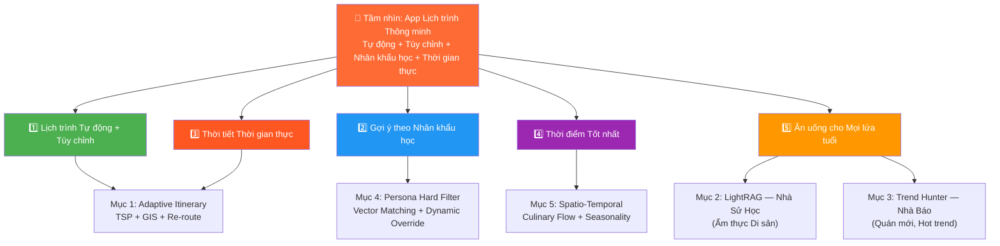
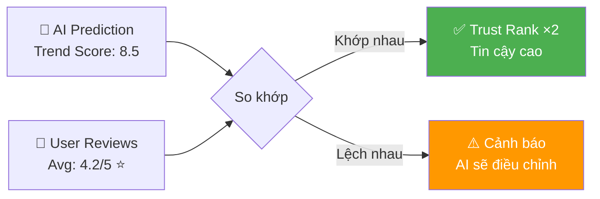

# 🌟 CÁC TÍNH NĂNG CỐT LÕI (CORE FEATURES)

Tài liệu này đi sâu vào phân tích 3 trụ cột tính năng tạo nên sự khác biệt của hệ thống so với các ứng dụng du lịch truyền thống trên thị trường.

### Bản đồ Tính năng → Mục tiêu Gốc

Mỗi tính năng dưới đây đều phục vụ trực tiếp cho **5 mục tiêu ban đầu** của dự án:



## 1. Cơ chế Tạo & Điều phối Lịch trình Tự động (Adaptive Itinerary Generator)
Khác với các list gợi ý địa điểm rời rạc, hệ thống tự động sinh ra một lịch trình hoàn chỉnh (Ví dụ: Chuyến đi 3 ngày 2 đêm tại Đà Nẵng). LUNA áp dụng mô hình **Cá nhân hóa Sâu (Deep Personalization)** tương tự cách thuật toán của **Netflix, Spotify hay YouTube** gợi ý nội dung. Nghĩa là không có hai người dùng nào nhận được lịch trình hoàn toàn giống nhau, ngay cả khi chọn cùng điểm đến và ngân sách. Mọi thứ được tinh chỉnh dựa trên thói quen, độ tuổi, và những thay đổi nhỏ nhất trong yêu cầu của người dùng.

### 🌐 Tính mở rộng & Phát triển (Scalability & Extensibility)
*   **Plug-and-Play Data:** Hệ thống thiết kế theo dạng Module rời. Khi cần mở rộng từ miền Trung (Huế-Đà Nẵng-Hội An) sang toàn quốc (Hà Nội, Sài Gòn, Đà Lạt), chỉ việc nạp thêm dữ liệu vào Milvus/Neo4j mà không phải sửa lại logic code. Thuật toán tự động "tiêu hóa" tọa độ mới và sinh ra lịch trình lập tức.
*   **Khả năng tự học (Feedback Loop):** Giống như khi bạn *Like/Dislike* một bài hát trên Spotify, mỗi lần người dùng bấm "Thay đổi địa điểm" (Swap), hệ thống ghi nhận lại sự không hài lòng đó để tinh chỉnh trọng số (Weights) trong tương lai. LUNA ngày càng hiểu bạn hơn sau mỗi chuyến đi.

### ⚡ Sự thoải mái và Linh hoạt Tối đa (Ultimate Flexibility)
Lịch trình sinh ra không "cứng" — user có quyền làm "Đạo diễn" cho chuyến đi của mình. Cảm giác sử dụng giống như lướt chọn phim trên Netflix: nếu không thích bộ phim mặc định, bạn có ngay danh sách "Top lựa chọn thay thế phù hợp nhất với bạn".

| Hành động Tùy chỉnh | Cách hoạt động |
|---------------------|---------------|
| **Thêm địa điểm** | User tìm/chọn từ bản đồ → Hệ thống tự xếp vào TimeSlot phù hợp nhất (giờ mở cửa, khoảng cách) |
| **Xóa địa điểm** | Bỏ 1 điểm → Hệ thống tự tối ưu lại tuyến đường cho các điểm còn lại |
| **Khóa địa điểm** 📌 | Đánh dấu "nhất định phải đi" → Thuật toán xếp các điểm khác xung quanh điểm bị khóa |
| **Đổi thứ tự** | Kéo-thả (drag-drop) TimeSlot → Hệ thống tự kiểm tra xung đột (giờ mở cửa, thời tiết) |
| **Thay đổi ngày** | Kéo dài / rút ngắn chuyến đi → Re-generate lịch trình với constraint mới |
| **Thay phương tiện** | Đổi từ Ô tô → Xe máy → Hệ thống mở khóa các quán trong hẻm nhỏ, loại bỏ ràng buộc bãi xe |

### 💰 Kiểm soát Ngân sách (Budget Tracking)
Hệ thống theo dõi chi phí **theo thời gian thực** và cảnh báo khi sắp vượt ngân sách:

**Mỗi điểm trong lịch trình đều có ước tính chi phí:**
| Loại chi phí | Nguồn dữ liệu | Ví dụ |
|-------------|---------------|-------|
| Vé tham quan | Crawl từ web chính thức | Đại Nội: 200K/người |
| Ăn uống | `price_range` trong metadata | Bún Bò Huế: 35-50K/tô |
| Di chuyển | Mapbox Directions API (khoảng cách × giá/km) | Grab: ~15K/km |
| Lưu trú (nếu overnight) | Crawl Booking/Agoda | Homestay: 300-500K/đêm |

**Cơ chế cảnh báo ngân sách:**
```
📊 Ngân sách: 2.000.000đ cho 3 ngày

Ngày 1: Đại Nội (200K) + Bún Bò (50K) + Grab (30K) + Café (45K) = 325K
Ngày 2: Bà Nà Hills (900K) + Lunch (150K) + Grab (60K) = 1.110K
         ⚠️ CẢNH BÁO: Đã dùng 72% ngân sách! Còn 565K cho Ngày 3.

→ Hệ thống tự động:
  1. Ưu tiên gợi ý địa điểm FREE (Bãi biển Mỹ Khê, Cầu Rồng, Chợ Hàn)
  2. Gợi ý đồ ăn budget thấp (Mì Quảng 30K, Bánh Tráng Cuốn 25K)
  3. Gợi ý đi bộ/xe máy thay vì Grab
```

**Ngưỡng cảnh báo:**
| Mức | Hành động |
|:---:|----------|
| **70%** | Hiển thị nhẹ: "Bạn đã dùng 70% ngân sách" |
| **90%** | Cảnh báo vàng: Tự động chuyển gợi ý sang `target_budget = low` |
| **100%** | Cảnh báo đỏ: "Vượt ngân sách! Gợi ý điểm đến miễn phí" + chặn gợi ý `high` |

    *   **Cơ chế Chống vòng lặp (Anti-Loop / Destination Fatigue):** Thuật toán áp dụng *Penalty (Phạt điểm)* để tránh sập bẫy lặp lại trải nghiệm. (VD: Nếu sáng đã uống Cafe, hệ thống ép giảm 50% trọng số của mọi quán Cafe vào buổi trưa để luân phiên sang Ẩm thực hoặc Di sản, tránh làm user mệt mỏi).
    *   **Điều tiết Đám đông (Crowd Control Vector):** Khi một địa điểm đang quá tải cục bộ (VD: Check-in bãi cỏ cháy Sơn Trà lúc hoàng hôn), thuật toán nhận diện mật độ (Density Capacity) và tự động Re-route user sang một tọa độ tương tự nhưng vắng vẻ hơn để đảm bảo trải nghiệm VIP.
*   **Phân bổ thời gian (Time Slot Allocation):** Khớp các điểm đến với Giờ mở/đóng cửa và Thời gian lưu trú trung bình (VD: Quán cafe check-in thường ngồi 1h, Tham quan Đại Nội mất 3h).
*   **Bộ lọc Đa dụng - Tái điều hướng (Real-time Weather Re-routing):** 
    *   Hệ thống liên tục check API Thời tiết theo thời gian thực (Real-time).
    *   **Kịch bản xảy ra:** Nếu người dùng đang dạo chơi buổi chiều, đột ngột có mây đen và cảnh báo mưa dông sắp tới. 
    *   Hệ thống lập tức gửi **Push Notification** đề xuất: *"Sắp có mưa rào, hệ thống đã chuẩn bị phương án B. Bạn có muốn đổi lịch sang đi Bảo tàng Chăm và uống Cafe có mái che gần đó không?"* (Lọc ưu tiên các địa điểm được dán nhãn `[Indoor]`, `[Sheltered]`).

### 🗺️ Bản đồ & Điều hướng (Map Navigation)
Bản đồ không chỉ để xem — mà là công cụ **dẫn đường** giữa các điểm trong lịch trình:

| Tính năng | Công nghệ | Trạng thái |
|----------|----------|:----------:|
| Hiển thị tuyến đường đa điểm (A → B → C → D) | Mapbox Directions API | ✅ MVP |
| Ước tính thời gian di chuyển giữa các điểm | Mapbox Directions API (`duration`) | ✅ MVP |
| Phân biệt đường **xe máy vs ô tô** | Tham số `profile`: `driving` (ô tô) / `cycling` (xe máy) | ✅ MVP |
| Hiển thị real-time traffic (kẹt xe) | Mapbox Traffic Layer | ✅ MVP |
| Chỉ đường turn-by-turn (rẽ phải 200m...) | Mapbox Navigation SDK | 📋 Phase 2 |

**Ví dụ tích hợp Mapbox Directions API:**
```javascript
// Lấy tuyến đường tối ưu giữa 3 điểm trong lịch trình
const waypoints = itinerary.slots
  .map(slot => `${slot.lng},${slot.lat}`)
  .join(';');

const profile = user.transport === 'car' ? 'driving' : 'cycling';

const response = await fetch(
  `https://api.mapbox.com/directions/v5/mapbox/${profile}/${waypoints}` +
  `?geometries=geojson&overview=full&steps=true&access_token=${MAPBOX_TOKEN}`
);

const data = await response.json();
// data.routes[0].duration  → Tổng thời gian (giây)
// data.routes[0].distance  → Tổng khoảng cách (mét)
// data.routes[0].geometry  → GeoJSON để vẽ tuyến đường trên bản đồ
// data.routes[0].legs[]    → Chi tiết từng chặng (A→B, B→C, ...)
//   .legs[0].duration      → "15 phút xe máy"
//   .legs[0].steps[]       → Turn-by-turn (Phase 2)
```

> **Ghi chú Phase 2:** Tính năng chỉ đường chi tiết turn-by-turn (rẽ trái, đi thẳng...) sẽ được phát triển ở giai đoạn sau. Ở MVP, user có thể bấm **"Mở Google Maps"** để dẫn đường chi tiết tới điểm tiếp theo.

Mục tiêu quan trọng nhất khi áp dụng AI vào ngành Du lịch Di sản là **Sự chính xác tuyệt đối**.
*   **Vấn đề của RAG cũ:** Nếu hỏi AI một sự tích phức tạp của Triều Nguyễn, AI có xu hướng tổng hợp từ nguồn rác hoặc "tự bịa" (Hallucination) các đời Vua.
*   **Sức mạnh của LightRAG:** Các tệp dữ liệu cốt lõi (sự kiện lịch sử, năm xây dựng, di sản văn hóa truyền thống theo năm tháng) được nhúng sâu vào cấu trúc Đồ thị (Neo4j). Khi có câu hỏi lịch sử, AI bắt buộc đi theo các "Cạnh" (Edges) trong Đồ thị đã duyệt để tổng hợp.
*   **Kết quả:** Câu trả lời mang tính chiều sâu như một "Nhà sử học" bản địa, tuyệt đối trung thành với "Ground Truth" (Dữ liệu Sự thật) và từ chối các thông tin bịa đặt.

## 3. Real-time Trend Hunter - "Nhà Báo" (Prompt Engineering mạng xã hội)
Thay vì nạp toàn bộ dữ liệu Trending trên mạng vào Milvus/Neo4j (sẽ gây rác và nhiễu loạn Đồ thị vì Trend có tuổi thọ rất ngắn), hệ thống dùng một Agent (Đại lý Bot) độc lập hoạt động như một "Nhà báo".

*   **Sử dụng sức mạnh Prompt Engineering nâng cao:** Khi người dùng hỏi "Tối nay Đà Nẵng có gì hot không?", AI thay vì lục lại Graph, sẽ kích hoạt Search Agent bắn các Prompt nâng cao trực tiếp ra công cụ tìm kiếm:
    > `site:tiktok.com "Đà Nẵng" "review" "hot trend" "mới mở" t11/2023`
    > Hoặc `site:facebook.com "sự kiện" "tối nay" "Huế"`
*   **Ép kiểu Đầu ra Có cấu trúc (Structured JSON Output):** Để ngăn chặn tình trạng LLM trả về văn bản lang man ("cám heo"), hệ thống sử dụng kỹ thuật *Structured Parsing* (VD: Pydantic trong Python). Dữ liệu cào về từ Internet bắt buộc phải được LLM "nhả" ra dưới dạng một chuỗi JSON siêu tinh gọn và rạch ròi các trường dữ liệu.
    > Kết quả trả về của Agent không phải là một bài văn, mà phải chuẩn xác là:
    > `{"place_name": "Quán Tạm", "trend_score": 9.2, "category": "Acoustic Bar", "price_tag": "$$", "matched_source": "tiktok.com/..."}`
    > Gói JSON này sẽ được đóng gói bằng **Protobuf** và truyền qua **gRPC** thẳng về cho NestJS xử lý mà không cần parse text.
*   **Lợi ích:** Đảm bảo hệ thống luôn được tiếp cận với các quán ăn mới mở tuần trước, các sự kiện âm nhạc Pop-up tối nay, hay các ly cà phê "Hot Trend mạng xã hội" mà không cần phải chạy lại toàn bộ Data Pipeline cồng kềnh.

## 4. Bộ lọc Cá nhân hóa Đa tầng (Demographics & Persona Hard Filter)
Hệ thống hoạt động linh hoạt thông qua 2 chế độ: **(1) Gợi ý điểm đến đơn lẻ (Suggestion Mode)** để người dùng tự do ghép nối và **(2) Tạo lịch trình hoàn toàn tự động (Auto-Itinerary Mode)**. Tuy nhiên, dù ở chế độ nào, mọi kết quả đều phải đi qua "Màng lọc cứng" (Hard Filter) để triệt tiêu các lựa chọn sai lệch với chân dung người dùng.

*   **So khớp Vector Chân dung (Persona Matching):** Khi thiết lập hồ sơ, hệ thống số hóa độ tuổi, ngân sách, và sở thích thành Vector. 
    > **Ví dụ thực tế:** Một người dùng bộc lộ hồ sơ: *[Tuổi Trung niên, Yêu thích Lịch sử, Thích Cafe tĩnh lặng (Chill Vibe), Ngân sách Tầm trung]*.
*   **Giải quyết Xung đột (Conflict Resolution):** Ngay cả khi Search Agent (Nhà Báo) tìm thấy một quán Bar/Pub đang cực kỳ "Hot trend", nhưng quán đó được gắn Meta-tag là `[Ồn ào/Sập sình]` và `[Giá cả: Đắt đỏ]`, thuật toán sẽ ưu tiên **loại bỏ (Hard Filter)** điểm đến này khỏi tập kết quả mặc định của người dùng đó.
*   **Cơ chế Vượt rào linh hoạt (Flexible Override):** Hệ thống không "đóng khung" người dùng quá cứng nhắc. Nếu người dùng (dù ở độ tuổi Trung niên) **chủ động Prompt** hoặc thiết lập trong Profile phụ là: *"Tôi thích âm nhạc sôi động, hãy tìm cho tôi chỗ giới trẻ hay quẩy"*, hệ thống lập tức cập nhật lại **Dynamic Persona Vector**. Lúc này, trọng số `[Vibe: Sôi động]` sẽ lấn át `[Age: Trung niên]`, cho phép hiển thị các quán Bar/Pub Hot Trend.
*   **Kết quả:** Hệ thống làm tốt việc bảo vệ trải nghiệm cốt lõi (không gợi ý rác/lạc quẻ), nhưng vẫn chừa không gian "Mở" (Open-minded) để chiều theo những sở thích "trẻ hóa" hoặc đột xuất của bất kỳ rào cản nhân khẩu học nào.

## 5. Nhận thức Không gian - Thời gian (Spatio-Temporal Awareness)
Một lịch trình thông minh không chỉ trả lời câu hỏi "Đi đâu?", mà phải trả lời được "Đi khi nào?". Hệ thống giải quyết triệt để tính phi logic của AI truyền thống bằng cơ chế nhận thức Spatio-Temporal:

*   **Ràng buộc Giờ giấc & Chuỗi sự kiện Ẩm thực (Time-of-day & Culinary Sequencing):** Khi sinh ra lịch trình hoặc gợi ý, AI luôn đối chiếu với nhãn `[Category]` và `[Operating_Hours]`. 
    > **Với Địa điểm:** Sẽ không bao giờ có chuyện AI gợi ý *"Tham quan Bảo tàng/Di tích lúc 5:00 sáng"* hay *"Leo núi lúc 22:00 đêm"* vì trái giờ sinh học và vận hành thực tế.
    > **Với Ẩm thực:** AI hiểu được **Trật tự logic của bữa ăn (Culinary Flow)**, tuyệt đối không gợi ý *"Ăn chè/Tráng miệng vào bữa sáng"*, mà sẽ xếp: Sáng ưu tiên Cafe/Đi dạo/Đồ nước (Bún/Phở) -> Trưa ăn chính (Cơm/Nhà hàng) -> Chiều ăn vặt -> Tối nướng/lẩu.
*   **An toàn Văn hóa và Tâm linh (Cultural & Spiritual Safety Constraints):** Đây là lằn ranh đỏ (Red Flag) mà AI truyền thống thường vi phạm. Hệ thống áp dụng quy tắc cấm kỵ (Taboo Filter) theo thời gian đối với các địa điểm tâm linh, di tích tang thương.
    > **Ví dụ:** Dù người dùng có tag `[Thích Lịch sử]`, hệ thống sẽ **block tuyệt đối** việc gợi ý *"Đi thăm nghĩa trang liệt sĩ Trường Sơn lúc 12h đêm"*, hoặc *"Thăm nhà lao Thừa Phủ lúc 2h sáng"*. Các địa điểm mang tính chất Tôn giáo/Tâm linh/Tang thương chỉ được phép xuất hiện trong slot khung giờ ban ngày (Sáng/Chiều) và ưu tiên phương tiện phù hợp.
*   **Vi điều phối Giao thông (Micro-Logistics & Parking Constraints):** Một yếu tố mà các App du lịch thường bỏ quên là loại phương tiện. Hệ thống tính toán đường đi dựa trên lựa chọn di chuyển của khách:
    > **Ví dụ:** Nếu khách báo "Đi bằng Ô tô", AI sẽ loại bỏ ngay các quán phở nằm trong "Hẻm nhỏ", hoặc loại bỏ các quán không có tag `[Car_Parking_Available]`. Nếu đang kẹt xe (kết nối API Google Traffic), AI sẽ cân nhắc đổi đề xuất sang các khu vực ngoại vi thoáng hơn, hoặc gợi ý khách đổi sang phương tiện 2 bánh (Xe máy) để linh hoạt.
*   **Phân vân giữa Lịch sử và Trend (Heritage vs Trending Context):** Trong cả Đồ ăn và Địa điểm, hệ thống luôn bóc tách 2 khái niệm này. 
    > **Ví dụ:** Với món ăn, "Bún Bò Huế mụ Rớt" là **Di sản (Heritage)**. Nhưng "Trà sữa kem cheese mắm ruốc" là **Trend mới**. Hệ thống cũng áp dụng tương tự với Di tích lịch sử ngàn năm đan xen các điểm Check-in mới mẻ, giúp lộ trình không quá "cổ lỗ sĩ" cũng không quá "trẻ trâu".
*   **Cảm biến Mùa vụ & Thời tiết Cực đoan (Seasonal & Extreme Weather Sensor):** Các địa điểm và món ăn được gắn Vector theo Mùa (Seasonality) và Cấp độ an toàn.
    > **Với Địa điểm:** Nếu API trả về dự báo thời tiết có bão giông, hệ thống sẽ **Hard-block (chặn cứng)** các trải nghiệm ngoài trời nguy hiểm. Không bao giờ có chuyện gợi ý *"Đi đèo Hải Vân"* hay *"Thánh địa Mỹ Sơn"* khi trời giông lốc. Lịch trình ép buộc chuyển về Indoor/Mái che.
    > **Với Ẩm thực:** Nếu đi Đà Nẵng vào tháng 1 (Trời lạnh 18 độ), hệ thống ưu tiên đề xuất *"Đi ăn Lẩu Bò, Đồ nướng"*. Nhưng nếu đi vào tháng 6 (Nắng nóng 38 độ), hệ thống lập tức đổi trọng số sang *"Ăn Hải sản ven biển, Chè/Kem giải nhiệt"*.
*   **Bộ nhớ Tạm (Save & Bookmark):** Khi AI dùng tính năng "Nhà Báo" săn được Trend (nhưng trái buổi hoặc sai mùa), thay vì vứt bỏ, hệ thống cho phép người dùng **"Lưu vào Wishlist (Save Itinerary)"**. Dữ liệu này trở thành một "Tài sản cá nhân" (Personal Asset). Khi người dùng quay lại vào đúng thời điểm phù hợp (ví dụ mùa đông năm sau), thuật toán sẽ quét lại Wishlist và lôi địa điểm này ra ưu tiên gợi ý đầu tiên.

## 6. 🧳 Chia sẻ & Lập lịch Nhóm (Group Trip Planning)
Du lịch hiếm khi đi một mình — LUNA hỗ trợ **lập kế hoạch nhóm** với tính năng cộng tác thời gian thực:

### Cơ chế hoạt động
```
👤 User A tạo lịch trình 3 ngày Đà Nẵng
   → Bấm "Chia sẻ" → Tạo link/QR code
   
👥 User B, C, D bấm link → Vào cùng Trip Room (Socket.IO)
   → Mọi người đều thấy lịch trình real-time
   
🗳️ Vote & Chọn:
   - AI gợi ý 3 phương án cho mỗi TimeSlot
   - Các thành viên vote 👍👎
   - Nơi nào >50% vote → Tự động vào lịch trình
   
💰 Chia tiền tự động:
   - Hệ thống tính tổng chi phí mỗi ngày
   - Chia đều hoặc chia theo % tùy chọn
   - Hiển thị: "A nợ B: 150K, C nợ A: 80K"
```

| Tính năng | Công nghệ | Trạng thái |
|----------|----------|:----------:|
| Trip Room (real-time sync) | Socket.IO Rooms | ✅ MVP |
| Share link / QR code | Short URL + QR Generator | ✅ MVP |
| Vote địa điểm | REST + WebSocket broadcast | ✅ MVP |
| Chia tiền tự động | Algorithm chia bill | ✅ MVP |
| Group Chat trong Trip | Socket.IO | 📋 Phase 2 |

### Persona nhóm (Group Persona Merge)
Khi nhóm có nhiều Persona khác nhau (Gen Z + Trung niên), hệ thống **merge vector** để tìm điểm chung:
```python
# Tính trung bình vector Persona của cả nhóm
group_vector = np.mean([user_a.persona, user_b.persona, user_c.persona], axis=0)
# → Gợi ý those nơi phù hợp với MỌI NGƯỜI trong nhóm
```

## 7. 🏆 Gamification — Huy hiệu & Thành tích
Biến du lịch thành trò chơi — tăng engagement và khuyến khích khám phá sâu hơn:

### Hệ thống Huy hiệu (Badges)
| Huy hiệu | Điều kiện | Icon |
|----------|----------|:----:|
| **Nhà Sử Học Huế** | Tham quan 5 di tích Huế | 🏛️ |
| **Thợ Ăn Đà Nẵng** | Check-in 10 quán ẩm thực | 🍜 |
| **Phượt Thủ Hải Vân** | Vượt đèo Hải Vân | 🏔️ |
| **Người Đêm Hội An** | Tham gia 3 sự kiện Night Market | 🏮 |
| **Master Chef** | Thử đủ 10 món Heritage miền Trung | 👨‍🍳 |
| **Trend Hunter** | Ghé 5 quán Hot Trend từ TikTok | 🔥 |
| **Mưa Không Ngăn Nổi** | Hoàn thành lịch trình Re-route khi mưa | ☔ |
| **Budget King** | Hoàn thành 3 ngày dưới 1 triệu đồng | 💰 |

### Điểm Kinh nghiệm & Bảng xếp hạng
*   **XP (Experience Points):** Mỗi địa điểm check-in = +10 XP. Review = +20 XP. Chia sẻ Trip = +30 XP.
*   **Level:** Newbie (0-100) → Explorer (100-500) → Master (500-1000) → Legend (1000+).
*   **Leaderboard:** Bảng xếp hạng theo tháng và theo vùng (Huế / Đà Nẵng / Hội An).
*   **Kết nối Persona:** User có nhiều XP ở category "Heritage" sẽ được tự động boost `interests: ["history"]` trong Persona Vector.

## 8. 📸 Travel Log — Nhật ký Chuyến đi Tự động
Hệ thống tự tạo nhật ký hành trình dựa trên dữ liệu thực tế:

```
📅 Nhật ký: "3 Ngày Đà Nẵng - Hội An" bởi @NgocUyen

🌅 Ngày 1 — Đà Nẵng
  09:00 📍 Bảo tàng Chăm ⭐ 4.5 — "Kiến trúc Chăm Pa rất đẹp!"
  12:00 🍜 Mì Quảng Bà Vị ⭐ 5 — "35K/tô, ngon nhất trip!"
  15:00 📍 Bãi biển Mỹ Khê ⭐ 4 — [📷 3 ảnh đính kèm]
  19:00 🍜 Hải sản Bé Mặn ⭐ 4.5

💰 Tổng chi: 450K | 🚶 Đi bộ: 8.2km | 📸 12 ảnh
```

*   **Tự động ghi nhận:** Dựa trên GPS check-in + feedback emoji + review ngắn.
*   **Chia sẻ:** Export dạng blog / story → Chia sẻ lên mạng xã hội hoặc trong LUNA community.
*   **Giá trị cho hệ thống:** Travel Log = Dữ liệu training cho AI → Cải thiện gợi ý cho user khác.

## 9. 🎫 Smart Booking — Đặt chỗ Thông minh
Tích hợp đặt vé/bàn trực tiếp ngay trong lịch trình:

| Loại | Tích hợp | Cách hoạt động |
|------|---------|---------------|
| **Vé tham quan** | API chính thức (Đại Nội, Bà Nà...) hoặc redirect Klook/GetYourGuide | Hiển thị giá + nút "Đặt ngay" bên cạnh mỗi TimeSlot |
| **Nhà hàng** | Redirect Google Maps / điện thoại trực tiếp | Nút "Đặt bàn" + Hiển thị giờ cao điểm |
| **Lưu trú** | Redirect Booking.com / Agoda (Affiliate link) | Gợi ý khách sạn gần vị trí sáng hôm sau |
| **Di chuyển** | Deep link Grab / Be | Nút "Gọi xe" với điểm đón = vị trí hiện tại, điểm đến = TimeSlot tiếp theo |

> **Ghi chú MVP:** Phase 1 dùng redirect/deep link. Phase 2 tích hợp API trực tiếp cho đặt vé Bà Nà Hills, Đại Nội.

## 10. 💬 Review Cộng đồng & Trust Score
Kết hợp đánh giá AI và đánh giá cộng đồng tạo thành **Dual Trust System**:

### Cơ chế Trust Score


*   **Review format:** ⭐ 1-5 + Tag ngắn ("View đẹp", "Đông quá", "Giá hợp lý", "Phục vụ chậm") + Ảnh (tùy chọn).
*   **Anti-spam:** Chỉ cho review sau khi GPS xác nhận đã đến địa điểm.
*   **Trust Score Feedback Loop:**
    *   Nếu User review cao + AI prediction cao → `trust_rank += 0.1` (khớp nhau = đáng tin)
    *   Nếu User review thấp + AI prediction cao → `trust_rank -= 0.2` (AI đang sai → tự điều chỉnh)
    *   Nếu User review cao + AI prediction thấp → AI phát hiện "Hidden Gem" tiềm năng

## 11. 🧠 AI Nhớ Dài hạn (Permanent Memory)
LUNA **nhớ** người dùng qua nhiều chuyến đi — không cần nhập lại sở thích:

### Cơ chế Memory
```
🗂️ MongoDB "user_memory" Collection:
{
  user_id: "usr_12345",
  trips: [
    {
      trip_id: "trip_001",
      destination: "Huế",
      date: "2025-01",
      liked: ["Bún Bò Huế mụ Rợi", "Đại Nội", "Chùa Thiên Mụ"],
      disliked: ["Quán X (đông, phục vụ chậm)"],
      weather_experienced: "rainy",
      budget_actual: 1_800_000
    }
  ],
  learned_preferences: {
    favorite_cuisine: ["Huế", "đồ nướng"],
    avoid: ["hải sản (dị ứng)"],
    preferred_pace: "relaxed",      // Từ dữ liệu: visit_duration thường > avg
    optimal_budget_per_day: 600_000  // Trung bình thực tế
  }
}
```

### Ví dụ thực tế
```
👤 User quay lại Đà Nẵng (lần 2):

💬 "Tôi muốn đi Đà Nẵng 2 ngày"

🧠 AI nhớ:
  - Lần trước đi Huế, thích Bún Bò → Gợi ý Bún Chả Cá Đà Nẵng (cùng style Heritage)
  - Lần trước dislike quán đông → Ưu tiên nơi ít đông (crowd_density < 0.5)
  - Budget thực tế 600K/ngày → Không gợi ý Bà Nà Hills (900K vé)
  - Dị ứng hải sản → Hard-block tất cả nhà hàng hải sản

💬 AI: "Chào lại bạn! Lần trước ở Huế bạn rất thích di sản.
         Lần này ở Đà Nẵng, mình gợi ý Bảo tàng Chăm + Ngũ Hành Sơn
         và quán Bún Chả Cá — nổi tiếng từ những năm 1970 nhé! 🏛️"
```

## 12. 🎭 Hidden Gem Discovery — Khám phá "Viên Ngọc Ẩn"
AI chủ động phát hiện những nơi **ít du khách biết nhưng chất lượng cao**:

### Công thức phát hiện Hidden Gem
```python
def is_hidden_gem(location: dict) -> bool:
    """
    Hidden Gem = Trust Score CAO + Trend Score THẤP + Review cộng đồng TỐT
    → Nơi tốt nhưng chưa nổi tiếng
    """
    return (
        location['trust_rank'] > 0.8              # Đánh giá cao từ AI + users
        and location.get('trend_score', 0) < 3.0  # Chưa viral trên MXH
        and location.get('user_rating', 0) >= 4.0  # Review thực tế tốt
        and location.get('total_reviews', 0) < 50   # Ít người biết
    )
```

### Ví dụ Hidden Gems miền Trung
| Nơi | Trust | Trend | User Rating | Lý do ẩn |
|-----|:-----:|:-----:|:-----------:|----------|
| Quán Cơm Hến bà Hoa (Huế) | 0.92 | 1.5 | 4.8⭐ | Trong hẻm nhỏ, không quảng cáo |
| Hầm rượu Debay (Bà Nà) | 0.88 | 2.0 | 4.5⭐ | Du khách thường bỏ qua |
| Bãi đá Bàn Than (Quảng Nam) | 0.90 | 1.0 | 4.7⭐ | Xa trung tâm, ít review |
| Quán Nem Lụi Bà Đệ (Huế) | 0.85 | 0.5 | 4.9⭐ | Chỉ bán buổi chiều |

> **Cách gợi ý:** Khi user đã đi đủ các điểm phổ biến, AI chủ động: *"Bạn đã khám phá hết các điểm nổi tiếng rồi! Mình có một 'viên ngọc ẩn' — Quán Cơm Hến bà Hoa trong hẻm 17 Nguyễn Chí Thanh, điểm đến yêu thích của dân địa phương. Muốn thử không?"* 💎

---
**Tóm tắt luồng AI hoạt động:**
Khách hàng đặt câu hỏi -> **AI Intelligent Router (Bộ định tuyến)** -> 
1. Liên quan lịch sử văn hóa lâu đời? -> Đẩy vào **LightRAG (Neo4j / Historian)**.
2. Liên quan Trend sớm nở tối tàn? -> Đẩy vào **Search Agent (Prompt Engineering / Reporter)**.
3. Liên quan thiết kế Tour? -> Đẩy vào **Adaptive Itinerary (Có xét thời tiết Indoor/Outdoor)**.
4. Đi nhóm? -> Kích hoạt **Group Trip Room (Socket.IO)** + **Persona Merge**.
5. Quay lại lần 2+? -> Load **Permanent Memory** + đề xuất dựa trên lịch sử.
