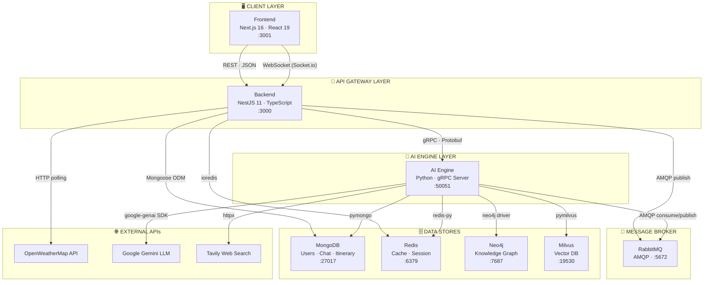
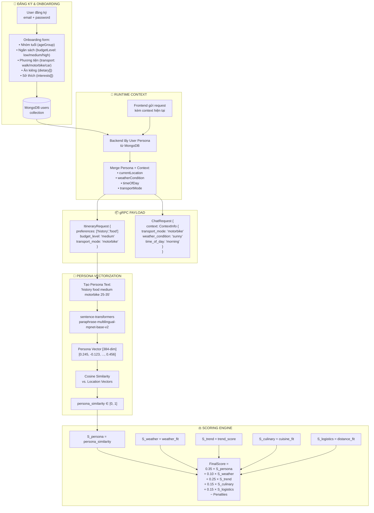
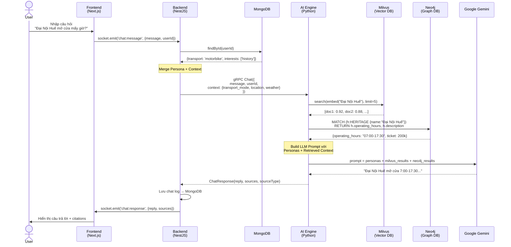
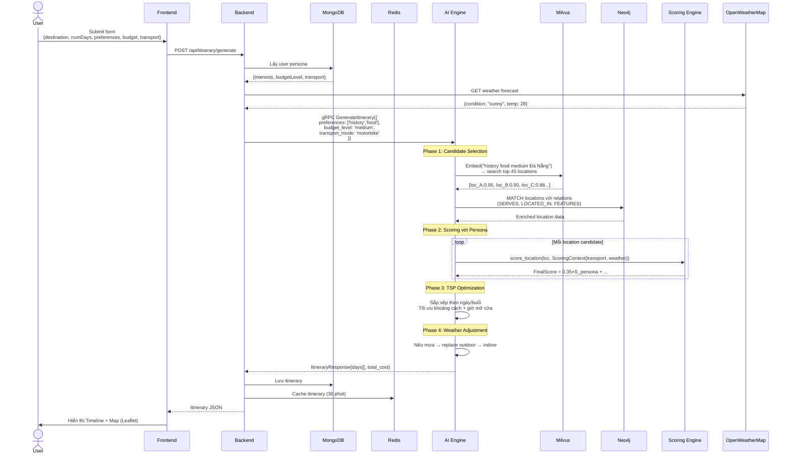
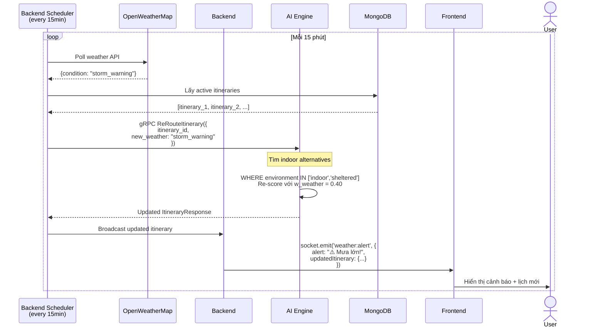
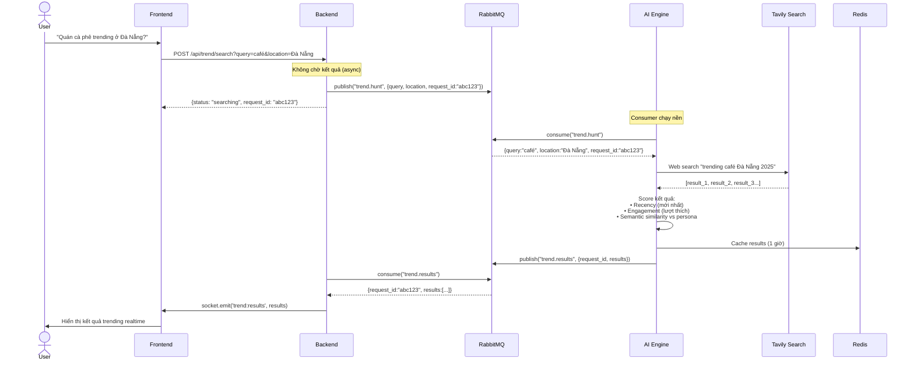
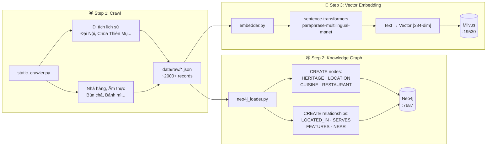
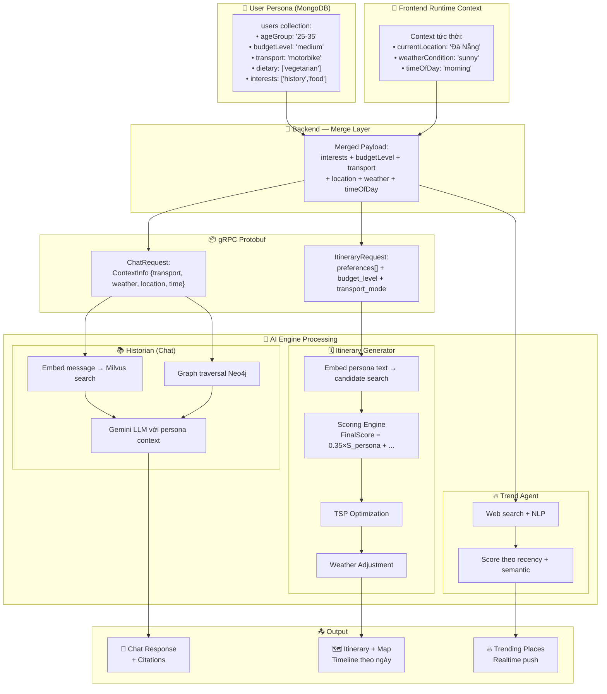
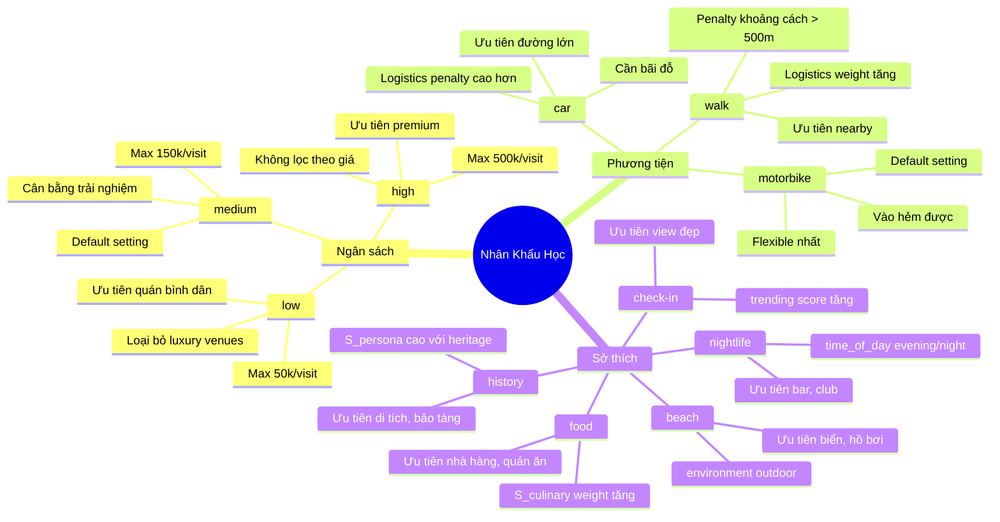
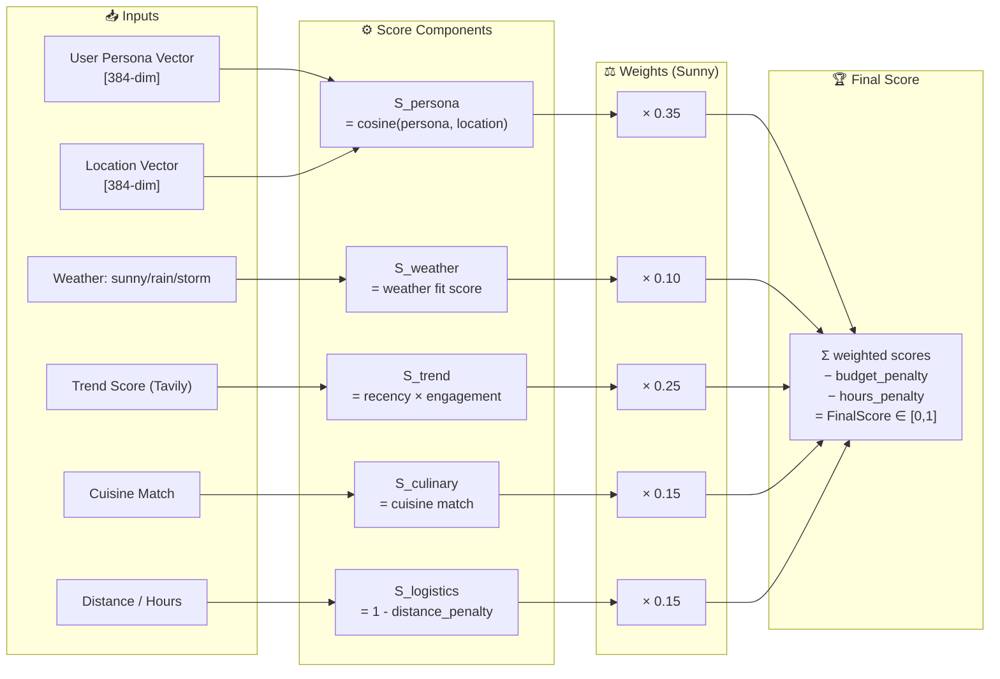

# LUNA TravelTech — Workflow & Demographic Flow Diagrams

---

## 1. Kiến trúc tổng thể (System Architecture)



---

## 2. Luồng Nhân Khẩu Học — Từ Đăng Ký đến Scoring



---

## 3. Trọng Số Động — Persona Shifts theo Context

```mermaid
quadrantChart
    title Trọng số Scoring theo Weather Condition
    x-axis Low Weather Priority --> High Weather Priority
    y-axis Low Persona Priority --> High Persona Priority
    quadrant-1 Balanced (sunny)
    quadrant-2 Persona-first
    quadrant-3 Logistics-first
    quadrant-4 Safety-first (storm)
    Sunny Day: [0.2, 0.7]
    Cloudy: [0.4, 0.55]
    Rainy: [0.65, 0.35]
    Stormy: [0.85, 0.2]
```

```mermaid
bar
    title Phân bổ trọng số theo điều kiện thời tiết
    x-axis ["Persona", "Weather", "Trend", "Culinary", "Logistics"]
    y-axis "Trọng số (%)" 0 --> 50
    bar [35, 10, 25, 15, 15] "☀️ Sunny (default)"
    bar [20, 40, 10, 15, 15] "⛈️ Stormy (safety-first)"
    bar [15, 10, 45, 15, 15] "🔥 Trend Query"
```

---

## 4. Use Case A — Chat (Nhà Sử Học)



---

## 5. Use Case B — Tạo Lịch Trình (TSP + Persona Scoring)



---

## 6. Use Case C — Weather Alert & Re-Routing



---

## 7. Use Case D — Trend Hunting (Async)



---

## 8. Data Pipeline — Khởi tạo Knowledge Base



---

## 9. Nhân Khẩu Học — Luồng Dữ Liệu Đầy Đủ End-to-End



---

## 10. Budget Levels & Transport Modes — Impact Map



---

## 11. Scoring Formula — Visual Breakdown


